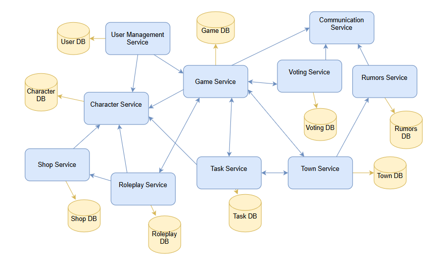

# Mafia Game Microservices Architecture

This diagram illustrates the microservice architecture for the Mafia Game. Each service is independent, owns its data, and communicates with others to implement the game rules, phases, and player interactions.

## Core Services

- **User Management Service**: Manages player identity, authentication, and profile information (User DB).

- **Character Service**: Tracks player inventory and in-game currency (Character DB).

- **Game Service**: Orchestrates the game loop, manages lobbies, tracks phases, and interacts with other services (Game DB).

- **Shop Service**: Handles the purchase of items by players, updating Character Service accordingly (Shop DB).

- **Roleplay Service**: Resolves player actions and abilities during night phases (Roleplay DB).

- **Task Service**: Assigns and validates role-specific tasks, issuing rewards (Task DB).

- **Town Service**: Maintains game locations and tracks player movements (Town DB).

- **Voting Service**: Collects and counts votes during the Voting phase (Voting DB).

- **Rumors Service**: Generates and manages rumors based on player interactions and locations (Rumors DB).

- **Communication Service**: Provides chat and messaging functionality, relaying game updates and rumors to players.

## Data Flow & Communication

- **Synchronous API calls** are used for transactional actions such as purchases, task completions, and profile updates.

- **Asynchronous events** (via message broker) handle night-action resolutions, rumors generation, and task notifications.

- **Game Service** serves as the central orchestrator, coordinating actions between services while enforcing game rules.