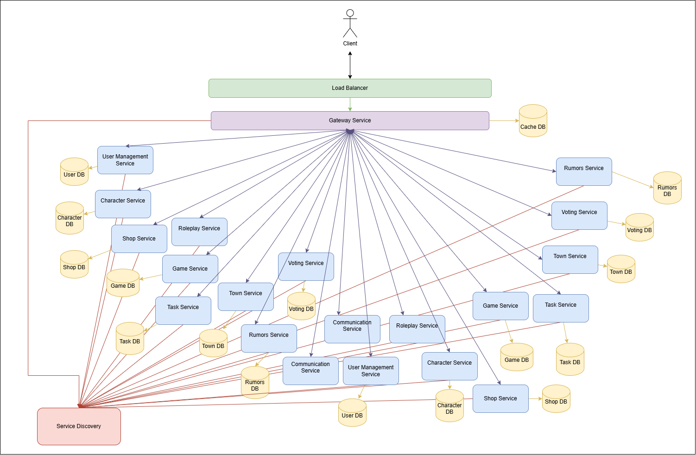

# Mafia Game Microservices Architecture

This diagram illustrates the microservice architecture for the Mafia Game. Instead of one monolithic application, the game is built from multiple independent services that each handle specific responsibilities. Services communicate through a central Gateway and can discover each other dynamically.

## Architecture Overview

**Client Access Flow:**
- Players connect through a **Load Balancer** that distributes traffic
- Requests go to the **Gateway Service**, which acts as the single entry point
- The Gateway routes requests to appropriate microservices
- A **Cache DB** improves performance by storing frequently accessed data

**Service Discovery:**
- All services register with **Service Discovery** (shown by red lines)
- This allows services to find and communicate with each other dynamically
- No hardcoded service locations needed

## Core Services

- **User Management Service**: Manages player identity, authentication, and profile information. Stores data in **User DB**.

- **Character Service**: Tracks player inventory and in-game currency. Stores data in **Character DB**.

- **Game Service**: The central orchestrator that manages the game loop, lobbies, phases, and coordinates between other services. Stores game state in **Game DB**.

- **Shop Service**: Handles the purchase of items by players, updating Character Service accordingly. Stores shop data in **Shop DB**.

- **Roleplay Service**: Resolves player actions and abilities during night phases (Mafia kills, Doctor saves, Detective investigations, etc.). Stores action data in **Roleplay DB**.

- **Task Service**: Assigns and validates role-specific tasks, issuing rewards upon completion. Stores task data in **Task DB**.

- **Town Service**: Maintains game locations and tracks player movements throughout the town. Stores location data in **Town DB**.

- **Voting Service**: Collects and counts votes during the day phase voting. Stores voting data in **Voting DB**.

- **Rumors Service**: Generates and manages rumors based on player interactions, locations, and night events. Stores rumors in **Rumors DB**.

- **Communication Service**: Provides chat and messaging functionality, relaying game updates, rumors, and allowing player communication. Stores message history in **User DB** (shared with User Management).

## Key Architecture Principles

- **Service Independence**: Each service can be developed, deployed, and scaled independently
- **Data Ownership**: Each service owns its database - no direct database sharing between services
- **Loose Coupling**: Services communicate through well-defined APIs, not direct database access
- **Centralized Gateway**: Single entry point simplifies security, monitoring, and routing

## Data Flow & Communication

- **Synchronous API calls** (via Gateway Service) are used for transactional actions such as purchases, task completions, profile updates, and voting.

- **Asynchronous events** (via message broker, not shown) handle night-action resolutions, rumors generation, and task notifications that don't require immediate responses.

- **Game Service** serves as the central orchestrator, coordinating actions between services while enforcing game rules and phase transitions.

- **Service-to-Service Communication**: Services can call each other directly for real-time operations (shown by interconnecting lines), but register with Service Discovery to locate each other.